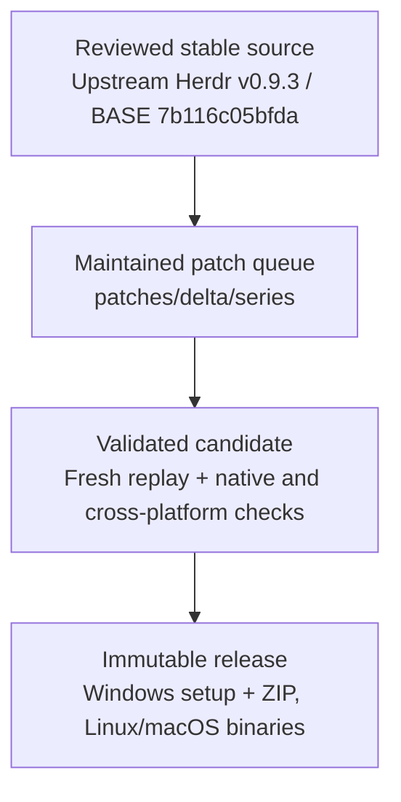

# Herdr Extended

**An upstream-friendly [Herdr](https://github.com/herdrdev/herdr) distribution for developers who need extended capabilities today: multi-agent extensions, terminal experience improvements, better OpenCode integration, and first-class Windows support.**

[](https://github.com/hdosys/herdr-ext/releases/latest) [](https://github.com/hdosys/herdr-ext/actions/workflows/ci.yml) [](https://github.com/hdosys/herdr-ext/actions/workflows/release.yml) [](https://github.com/hdosys/herdr-ext/blob/master/rust-toolchain.toml) [](https://github.com/hdosys/herdr-sandbox) [](https://github.com/hdosys/herdr-ext/blob/master/LICENSE)

Herdr Extended is an unofficial, upstream-first distribution that makes practical bug fixes and extensions available today through a small, reviewable patch queue designed for upstream adoption. Its strongest focus areas are multi-agent workflows, terminal experience, OpenCode reliability, and Windows support. It complements upstream Herdr while the executable, command, configuration, state, sessions, sockets, and protocol remain `herdr`.

Every published release contains matching Windows, Linux, and macOS binaries built from one reviewed stable Herdr release and one ordered patch queue. Releases are normal stable GitHub releases, and the integrated update paths reject prerelease feeds.

**Current release:** [2026.10.03.3](https://github.com/hdosys/herdr-ext/releases/tag/v2026.10.03.3), based on Herdr v0.9.3. See the [changelog](https://github.com/hdosys/herdr-ext/blob/master/CHANGELOG.md) for shipped changes.

[What differs from upstream](#what-differs-from-upstream) · [Install](#install) · [First use](#first-use) · [Everyday use](#everyday-use) · [Troubleshooting](#troubleshooting) · [Project reference](#project-reference)

## See it in action

https://github.com/user-attachments/assets/b6c02367-683b-4a1f-94e6-b662149d89d9

Detach from a Windows-hosted Herdr session, reconnect from another terminal, and continue the same OpenCode session without RDP.

## Engineering approach

- **Upstream-first and contribution-oriented:** each behavior has one responsibility-owned mailbox designed for focused upstream review and leaves the queue when equivalent support ships upstream.
- **One coherent distribution:** release assets share one source tree and build identity. Compatible attachment negotiates the upstream endpoint protocol; provisioning verifies the exact payload.
- **Real boundary evidence:** Windows setup, ConPTY packaging, SSH provisioning, updates, uninstall, and cross-platform artifacts are exercised at their product-owned boundaries before publication.
- **No parallel product:** fork identity stays in repository, release, update-feed, setup, and Installed Apps presentation while normal Herdr commands and state remain unchanged.

> [!NOTE]
> Herdr Extended is developed and validated with [**Herdr Sandbox**](https://github.com/hdosys/herdr-sandbox), a sister project that provides disposable native Windows environments for coding agents. It is not a runtime dependency.

## How it works



[`patches/delta/BASE`](https://github.com/hdosys/herdr-ext/blob/master/patches/delta/BASE) records the exact reviewed upstream stable commit. [`series`](https://github.com/hdosys/herdr-ext/blob/master/patches/delta/series) is the only patch order. A manual build replays that source and retains one complete candidate; promotion publishes those exact bytes without rebuilding or repackaging them.

## What differs from upstream

Herdr Extended combines original extensions, reviewed upstream corrections, Windows integration work, and regression tests. The tables below compare the maintained queue with its **Herdr v0.9.3 base**. Each row identifies current ownership and links to the implementation, integration, or verification work. Contributions remain visible as equivalent behavior is adopted upstream.

### Maintained extensions and fixes

| Area | Current ownership | What this repository contributes |
| --- | --- | --- |
| Terminal experience | 🟡 **Upstream foundation, extended here** · [`0001`](https://github.com/hdosys/herdr-ext/blob/master/patches/delta/0001-windows-terminal-appearance.patch) | Follows the host appearance by default when unconfigured, preserves host and child cursor colors, supports Windows VTI observations, and avoids automatic OSC 4 palette queries. |
| Windows SSH hosting | 🟡 **Upstream foundation, extended here** · [#2329](https://github.com/herdrdev/herdr/pull/2329) · [`0003`](https://github.com/hdosys/herdr-ext/blob/master/patches/delta/0003-windows-remote-attach.patch) | Extends upstream Windows-client and x86_64-host support with ARM64 targets, exact payload provisioning and activation, visible progress, and guarded launch in the SSH user's active desktop session. |
| Remote configuration provisioning | **Maintained here** · [`0003`](https://github.com/hdosys/herdr-ext/blob/master/patches/delta/0003-windows-remote-attach.patch) | Explicit provisioning transfers client settings to Windows and Unix targets, preserves machine-local values, validates the result, and reports whether configuration was applied. |
| Managed Windows distribution | 🟡 **Upstream foundation, extended here** · [`0004`](https://github.com/hdosys/herdr-ext/blob/master/patches/delta/0004-windows-managed-distribution.patch) · [Identity and packaging inventory](https://github.com/hdosys/herdr-ext/blob/master/patches/delta/README.md) | Adds branded setup and artwork, immutable leased runtimes, safe pending activation, fork-owned stable updates, WinGet ownership, and process-safe uninstall. Slots `0032` through `0035` maintain distribution identity and release asset presentation. |
| OpenCode and multi-agent workflows | 🟡 **Upstream foundation, extended here** · [#3052](https://github.com/herdrdev/herdr/issues/3052) · [#2450](https://github.com/herdrdev/herdr/issues/2450) · [`0005`](https://github.com/hdosys/herdr-ext/blob/master/patches/delta/0005-opencode-retry-notifications.patch) | Adds retry/error correlation, stricter pane-local root ownership, immediate child-work reporting, and adaptive panes for concurrent direct subagents. |
| Runtime downloads | **Maintained here** · [`0006`](https://github.com/hdosys/herdr-ext/blob/master/patches/delta/0006-harden-curl-transfers.patch) | Ignores user `curl` configuration and bounds runtime downloads to TLS 1.2+ HTTPS with limited redirects. |
| Worktree lifecycle | 🟡 **Upstream foundation, extended here** · [#3044](https://github.com/herdrdev/herdr/issues/3044) · [`0008`](https://github.com/hdosys/herdr-ext/blob/master/patches/delta/0008-worktree-scoped-git-trust.patch) | Scopes Git trust to the exact checkout for the child command and waits for Windows PTY shutdown before unregistering a worktree. |
| Managed agent start | 🟡 **Upstream foundation, extended here** · [#321](https://github.com/herdrdev/herdr/issues/321) · [#2685](https://github.com/herdrdev/herdr/issues/2685) · [`0009`](https://github.com/hdosys/herdr-ext/blob/master/patches/delta/0009-session-agent-autostart.patch) | Adds the client-preferred `prefix+o` shortcut, optional new-tab agent start, live-reload catch-up, and selected-shell rendering shared with session restore. |
| Agent hook recovery | **Maintained here** · [#1033](https://github.com/herdrdev/herdr/issues/1033) · [`0010`](https://github.com/hdosys/herdr-ext/blob/master/patches/delta/0010-agent-transient-hook-takeover.patch) | Lets a still-running full-lifecycle Agent regain hook authority after a temporary foreground takeover without reviving a session after a real exit. |
| Metadata capacity | **Maintained here** · [`0011`](https://github.com/hdosys/herdr-ext/blob/master/patches/delta/0011-metadata-token-capacity.patch) | Atomically updates and retains up to 64 pane or workspace metadata tokens while preserving existing validation bounds. |
| Completion alerts | 🟡 **Upstream foundation, extended here** · [`0012`](https://github.com/hdosys/herdr-ext/blob/master/patches/delta/0012-agent-completion-controls.patch) | Adds a persistent completion-only popup and sound opt-out plus cancellation suppression without disabling questions, permission prompts, or errors. |
| Integration settings guidance | **Maintained here** · [#2880](https://github.com/herdrdev/herdr/issues/2880) · [`0016`](https://github.com/hdosys/herdr-ext/blob/master/patches/delta/0016-settings-integration-hints.patch) | Removes the misleading row-selection hint from Settings > integrations while retaining section-navigation guidance. |
| Windows endpoint transport | **Maintained here** · [`0020`](https://github.com/hdosys/herdr-ext/blob/master/patches/delta/0020-windows-endpoint-writer-progress.patch) | Uses bounded write chunks and Windows pipe capacity to preserve polling-peer progress and detect stalled writes. |
| Session deletion | **Maintained here** · [#3819](https://github.com/herdrdev/herdr/issues/3819) · [`0028`](https://github.com/hdosys/herdr-ext/blob/master/patches/delta/0028-exact-recorded-session-deletion.patch) | Tightens recorded-directory selection and reports unmatched names rather than apparent success, preserving upstream exact-name and live-session guards. |
| Local startup diagnostics | **Maintained here** · [#3759](https://github.com/herdrdev/herdr/issues/3759) · [`0029`](https://github.com/hdosys/herdr-ext/blob/master/patches/delta/0029-local-startup-diagnostics.patch) | Keeps Local startup errors visible without freezing healthy remote views or losing the diagnostic during view changes. |
| Machine setup and onboarding | **Maintained here** · [`0031`](https://github.com/hdosys/herdr-ext/blob/master/patches/delta/0031-machine-setup-discovery.patch) · [`0038`](https://github.com/hdosys/herdr-ext/blob/master/patches/delta/0038-onboarding-configured-prefix.patch) | Adds an Add machine menu link to setup documentation and shows the configured prefix key in onboarding. |
| Clickable script status labels | **Maintained here** · [`0036`](https://github.com/hdosys/herdr-ext/blob/master/patches/delta/0036-clickable-script-status.patch) | Supports multiple OSC 8 web links in bounded command output, opened in the attached client's browser while retaining plain-text compatibility. |
| Windows process boundaries | **Maintained here** · [`0037`](https://github.com/hdosys/herdr-ext/blob/master/patches/delta/0037-windows-process-boundaries.patch) | Uses the required process-termination rights and omits inherited environment values from PTY trace diagnostics. |

### Upstream adoption and retained regression coverage

When equivalent behavior reaches the reviewed upstream base, its fork implementation is retired. The history and references remain visible here; additional boundary tests are identified separately from runtime extensions.

| Area | Current ownership | Integration and verification work |
| --- | --- | --- |
| Native ConPTY foundation | ✅ **Provided upstream** | Reuses upstream's modern app-local ConPTY packaging rather than maintaining a duplicate foundation. |
| Windows bridge downloads | ✅ **Upstream runtime, additional regression coverage** · [`0019`](https://github.com/hdosys/herdr-ext/blob/master/patches/delta/0019-windows-bridge-blocking-download.patch) | Exercises the upstream bridge through native Windows polling/download and peer-disconnect checks. |
| Associated control-key text | ✅ **Upstream runtime, additional regression coverage** · [`0021`](https://github.com/hdosys/herdr-ext/blob/master/patches/delta/0021-associated-control-key-text.patch) | Extends captured Tab/Escape parser cases without replacing the upstream parser implementation. |
| Public agent focus | ✅ **Upstream runtime, additional regression coverage** · [`0026`](https://github.com/hdosys/herdr-ext/blob/master/patches/delta/0026-public-agent-focus-projection.patch) | Checks that failed focus requests preserve the client view and bounds test response waits. |
| Nested mouse and multi-machine workspace views | ✅ **Provided by the reviewed upstream base** · [Retirement inventory](https://github.com/hdosys/herdr-ext/blob/master/patches/delta/README.md) | The v0.9.2 refresh retired the corresponding mouse, collapse-scoping, requesting-client focus, navigation, geometry, and resize patches. These capabilities remain available. |
| Cross-platform docs checks | ✅ **Provided by Herdr v0.9.0** · [#3041](https://github.com/herdrdev/herdr/issues/3041) | Uses upstream's native-path documentation-parity assertion on Windows and POSIX systems. |
| Terminal history | ✅ **Provided by Herdr v0.9.2** · [#2893](https://github.com/herdrdev/herdr/issues/2893) | Upstream owns the current history implementation; the older fork mailbox is retired. |
| Plugin command resolution | ✅ **Provided by Herdr v0.9.0** · [#3024](https://github.com/herdrdev/herdr/issues/3024) | Resolves explicit relative pane commands from the linked plugin root, including Windows plugin-local executables. |
| Muted-label contrast | ✅ **Provided by Herdr v0.9.2** · [#2692](https://github.com/herdrdev/herdr/issues/2692) | Keeps muted sidebar and inactive tab labels readable without the older fork mailbox. |
| Devin configuration | ✅ **Provided by Herdr v0.9.0** · [#2724](https://github.com/herdrdev/herdr/issues/2724) | Finds Devin's native configuration in roaming AppData while respecting an explicit XDG override. |
| Windows environment validation | ✅ **Provided by Herdr v0.9.0** · [#3430](https://github.com/herdrdev/herdr/issues/3430) | Rejects malformed Windows environment entries and validates registry values before process creation. Diagnostic privacy remains a separate maintained correction above. |

The [changelog](https://github.com/hdosys/herdr-ext/blob/master/CHANGELOG.md) records when each improvement shipped. The [patch inventory](https://github.com/hdosys/herdr-ext/blob/master/patches/delta/README.md) identifies current responsibility and reviewed source, with original author credit retained in each mailbox.

## Install

### Requirements and installation choices

Every release provides Windows, Linux, and macOS builds as one coherent distribution. Choose one installation method for each machine:

- **Windows x64:** use direct setup, WinGet, or the portable ZIP.
- **Linux and macOS (amd64 or arm64):** download the executable for your architecture.

Use an interactive terminal and install the coding agents you want to run separately. Windows managed installations are per-user, require no administrator access, and need no separately installed Microsoft Visual C++ Redistributable. Run setup or WinGet from a non-administrator terminal.

> [!WARNING]
> The executable and setup are currently unsigned, so Windows may show a SmartScreen warning. Download only from this repository and verify the SHA-256 digest before running the artifact.

### Windows direct setup

Download the Windows setup from the [latest Herdr Extended release](https://github.com/hdosys/herdr-ext/releases/latest), verify its GitHub SHA-256 digest, and run it.

<p align="center">
  
</p>

The managed install lives under `%LOCALAPPDATA%\Programs\Herdr`, registers **Herdr Extended** in Installed Apps, installs Herdr's canonical agent skill, and preserves customized skill copies.

### Windows with WinGet

```powershell
winget install --id hdosys.herdr-win --exact --source winget
```

The package ID remains `hdosys.herdr-win`. WinGet receives new versions after Microsoft accepts the manifest into its catalog, so it can lag behind GitHub releases. Track the [2026.10.03.3 submission](https://github.com/microsoft/winget-pkgs/pull/446485), or use direct setup for the latest GitHub release.

### Windows portable

The Windows release also includes a matching portable ZIP. Extract the complete archive into one directory and run `herdr.exe`; keep its ConPTY payload beside it.

### Linux and macOS

Linux and macOS releases are raw `linux_amd64`, `linux_arm64`, `macos_amd64`, and `macos_arm64` executables.

After downloading a Linux or macOS asset, mark it executable, rename it to `herdr`, and place it in a directory on `PATH`.

## First use

Open a new terminal after installation and run:

```powershell
herdr --version
herdr
```

A published build reports `herdr-ext <CalVer> (Herdr <upstream-version>)`. The second command opens Herdr's normal keyboard-first terminal interface. General commands, configuration, keybindings, and integrations remain documented by the [official Herdr guide](https://herdr.dev/docs/).

Herdr works with its defaults. To customize it, edit `%APPDATA%\herdr\config.toml` on Windows; `HERDR_CONFIG_PATH` can select another file. The optional settings below go in that file.

## Everyday use

### Start an agent

With **Herdr Extended's default bindings**, press **prefix then o** to start your preferred installed agent in the selected available shell, including a selected remote pane. The shipped `[agent]` default is `kind = "opencode"`; client settings can select another agent. **prefix then Shift+O** opens the notification target. These defaults need no shell alias or personal configuration; explicit keybinding overrides still take precedence.

### Clickable status labels

Script-generated status labels can include multiple OSC 8 web links in one command output. Click an underlined section to open it in the client's browser, even when the producer runs remotely. Plain-text commands still work. See the [producer contract](https://github.com/hdosys/herdr-ext/blob/candidate/development/docs/next/website/src/content/docs/configuration.mdx) before adapting scripts.

### Mixed-platform sessions

Run the client and server on Windows, or use an endpoint-compatible Linux or macOS client to control a Windows workstation or VM. Windows can also connect to compatible Linux and macOS endpoints. A compatible version difference alone does not restart a running server; saved-machine reconnects never install, replace, or start a missing server.

Every supported client can attach to or provision an x86_64 or ARM64 Windows SSH host. Use `--yes` to approve a required install or restart for one normal attach; unattended provisioning remains explicit:

```powershell
herdr --remote workbox --yes
herdr --remote workbox --provision --yes --json
```

The Windows SSH user's OpenSSH default shell must be `cmd.exe` or PowerShell 7 (`pwsh.exe`), and persistent server launch requires exactly one active desktop session owned by that user. The first probe is reused for the complete decision, the portable payload transfers once, and visible progress reports every real preparation, validation, stop, activation, verification, and opening phase. Provisioning validates the complete payload before stopping or replacing a server and verifies the exact binary, version, and protocol afterward.

Explicit provisioning also transfers your existing client configuration to Windows or Unix targets, without a separate per-host file. Machine-local shell and directory paths, agent arguments, custom command bindings, the status-bar entry list, sound paths, and onboarding state stay on the target; other settings come from the client. The result is validated before writing. Ordinary attachment does not synchronize configuration. See the [configuration policy](https://github.com/hdosys/herdr-ext/blob/master/PRODUCT.md).

### Fork-specific options

Automatic agent startup is **off by default**. To opt in to starting OpenCode in the root pane of each genuinely new persistent-session tab, add:

```toml
[session]
auto_start_agent = "opencode"
```

This managed launch also supplies the ephemeral loopback endpoint used by direct
OpenCode subagent panes. Typing a bare `opencode` command starts OpenCode's internal
worker transport without that attach endpoint, so use the managed path for this
integration.

Use **Settings > completion**, or disable completion popups and done sounds without suppressing questions, permission prompts, or errors:

```toml
[ui]
notify_on_agent_completion = false
```

### Updates

**Herdr Win has been renamed to Herdr Extended.** Release downloads now start
with `herdr-ext`; the command remains `herdr` and the WinGet ID remains
`hdosys.herdr-win`.

- WinGet installation: `winget upgrade --id hdosys.herdr-win --exact --source winget`.
  New releases appear there after the WinGet manifest is accepted into the catalog.
- Manual Windows installation: download and run the current installer from the
  [release page](https://github.com/hdosys/herdr-ext/releases/latest). It updates an
  existing managed installation without uninstalling it or removing your settings.
- Portable, Linux, or macOS installation: replace it with the matching release
  download, or use `herdr update` on clients that support the renamed assets.

If an older client's built-in update rejects the new filename, use the package
manager or manual download above instead.

Direct updates accept only a newer stable CalVer from an immutable normal GitHub release. Active sessions continue on their current immutable runtime and the replacement activates safely afterward; update never terminates running work. `herdr update` refuses to replace a WinGet-managed installation.

## Uninstall

Uninstall from **Windows Settings > Apps > Installed apps**. Herdr first asks running managed sessions to stop through their graceful server API. If a session remains active, uninstall preserves the installation and reports the required action instead of force-terminating work.

Configuration and sessions under `%APPDATA%\herdr` are preserved unless you explicitly choose to remove them. Profile `.herdr` worktrees, remote payloads and custom configuration locations remain untouched. Installer-known skill copies are selected for removal by default. Customized copies are preserved unless you explicitly select their removal; sibling files remain untouched.

Installers before **2026.10.03.3** selected `%USERPROFILE%\.herdr` for settings removal instead. Leave that option unchecked when using an older uninstaller, especially if that directory contains worktrees. The current release uses the corrected `%APPDATA%\herdr` location.

## Troubleshooting

| Symptom | Action |
| --- | --- |
| `herdr --version` does not start with `herdr-ext` | Open a new terminal, run `where.exe herdr`, and inspect an earlier upstream or user-owned executable on `PATH`. Setup does not overwrite foreign PATH ownership. |
| Setup rejects an existing Herdr layout | Uninstall the existing **Herdr** entry from Installed Apps, then run setup again. The installer preserves and rejects incompatible layouts instead of migrating them. |
| SmartScreen warns about the download | Confirm that the file came from this repository's release page and verify its GitHub SHA-256 digest before choosing to run it. |
| Windows SSH provisioning fails before session start | Confirm that the default OpenSSH shell is `cmd.exe` or `pwsh.exe` and that exactly one active desktop session belongs to the SSH user. Windows PowerShell 5.1 is unsupported for this byte-stream path. |
| Update remains pending, or uninstall reports running sessions | Let active work finish or stop the reported Herdr sessions, then launch or retry. The managed lifecycle never force-terminates active work. |

For exact changes in downloadable releases, see the [Herdr Extended changelog](https://github.com/hdosys/herdr-ext/blob/master/CHANGELOG.md). For general Herdr behavior, use the [upstream documentation](https://herdr.dev/docs/) and [upstream changelog](https://github.com/herdrdev/herdr/blob/master/CHANGELOG.md).

## Project reference

This README describes the maintained queue on `master`. The distribution [changelog](https://github.com/hdosys/herdr-ext/blob/master/CHANGELOG.md) is the exact user-facing history for tagged Herdr Extended releases. Upstream Herdr owns the general CLI, TUI, configuration, integrations, and product documentation.

<details>
<summary><strong>Patch queue and upstream review</strong></summary>

GitHub's **ahead/behind** banner compares commit ancestry, not release-source freshness. This repository's `master` is a control branch for the patch queue and release automation, not a mirror of upstream `master`. GitHub's **Sync fork** action is not this project's refresh mechanism.

Upstream PR [#2329](https://github.com/herdrdev/herdr/pull/2329) ships in Herdr v0.8.2. Mailbox `0003` therefore contains only the remaining Windows target-host boundary. Shared client attach, image transport, and SSH bridge behavior come directly from upstream.

The original Windows-host work builds on [nsxdavid's `feat/windows-remote-attach` branch](https://github.com/nsxdavid/herdr/tree/feat/windows-remote-attach).

The files in `patches/delta/series` are the complete maintained product delta:

1. Start at the exact commit in [`BASE`](https://github.com/hdosys/herdr-ext/blob/master/patches/delta/BASE).
2. Apply [`series`](https://github.com/hdosys/herdr-ext/blob/master/patches/delta/series) in order with `git am --3way`.
3. Review each mailbox as one responsibility with its implementation, tests, and documentation.
4. Follow [`CONTRIBUTING.md`](https://github.com/hdosys/herdr-ext/blob/master/CONTRIBUTING.md) for replay and verification.

The mailboxes are focused evidence, not an all-or-nothing merge request. Repository-only branding, release workflows, and publication state stay outside the product queue; runtime and installer presentation are maintained in their owning patches.

</details>

<details>
<summary><strong>Maintaining the project</strong></summary>

Refresh and release are separate manual operations:

- **Refresh:** select and review a stable upstream release, then replay and minimize the queue.
- **Build:** replay recorded `BASE`, run the complete gates, and retain one candidate with provenance and checksums.
- **Promote:** publish those exact retained bytes without rebuilding or repackaging them.

Ordinary pushes do not publish binaries.

| Need | Canonical owner |
| --- | --- |
| User-visible fork behavior | [`PRODUCT.md`](https://github.com/hdosys/herdr-ext/blob/master/PRODUCT.md) |
| Technical boundaries | [`ARCHITECTURE.md`](https://github.com/hdosys/herdr-ext/blob/master/ARCHITECTURE.md) |
| Patch ownership and refresh policy | [`patches/delta/README.md`](https://github.com/hdosys/herdr-ext/blob/master/patches/delta/README.md) |
| Replay, verification, and release procedure | [`CONTRIBUTING.md`](https://github.com/hdosys/herdr-ext/blob/master/CONTRIBUTING.md) |
| Selected future product work | [`BACKLOG.md`](https://github.com/hdosys/herdr-ext/blob/master/BACKLOG.md) |

</details>

### Issues and contributions

- Use [upstream Herdr](https://github.com/herdrdev/herdr) for general behavior that reproduces with an official upstream build.
- Use [Herdr Extended issues](https://github.com/hdosys/herdr-ext/issues) for this distribution's artifacts, update feed, workflows, or maintained patches.
- Read [`CONTRIBUTING.md`](https://github.com/hdosys/herdr-ext/blob/master/CONTRIBUTING.md) before changing the queue or release automation.

## Credits and license

Herdr is created and maintained upstream by [Can Çelik](https://github.com/ogulcancelik). Herdr Extended is distributed under the [Apache License 2.0](https://github.com/hdosys/herdr-ext/blob/master/LICENSE).
